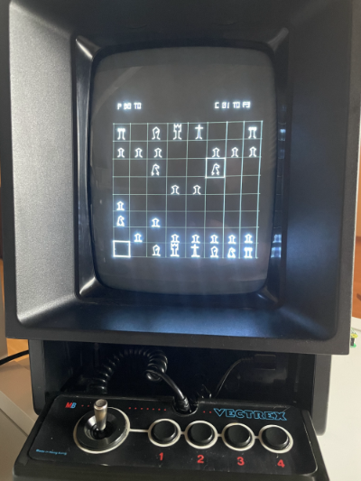

# PiTrex chess

This is work in progress version of chess for the PiTrex. 

TODO:

- Different optimisations (as Y fix)
- Visual feedback of check
- Visual feedback of check mate
- Change of side in game
- Suport of all "special" moves (Knight etc.)

DONE:

- Baremetal support added, thanks Malban! [04-12-21]
- Use v_window and remove conversion to DAC coordinates [04-12-21]
- Organise playfield in *top area info* | *playfield* 
- Visual feedback of wrong moves [04-11-21]
- UI shows now last move of player AND computer [04-11-21]
- Animated movements of the chess figures [04-09-21]
- Improve drawings [04-09-21]
- Put chess engine in 2nd thread to avoid screen waiting times [04-07-21]
- XCode playground (must be improved) [04-07-21]
